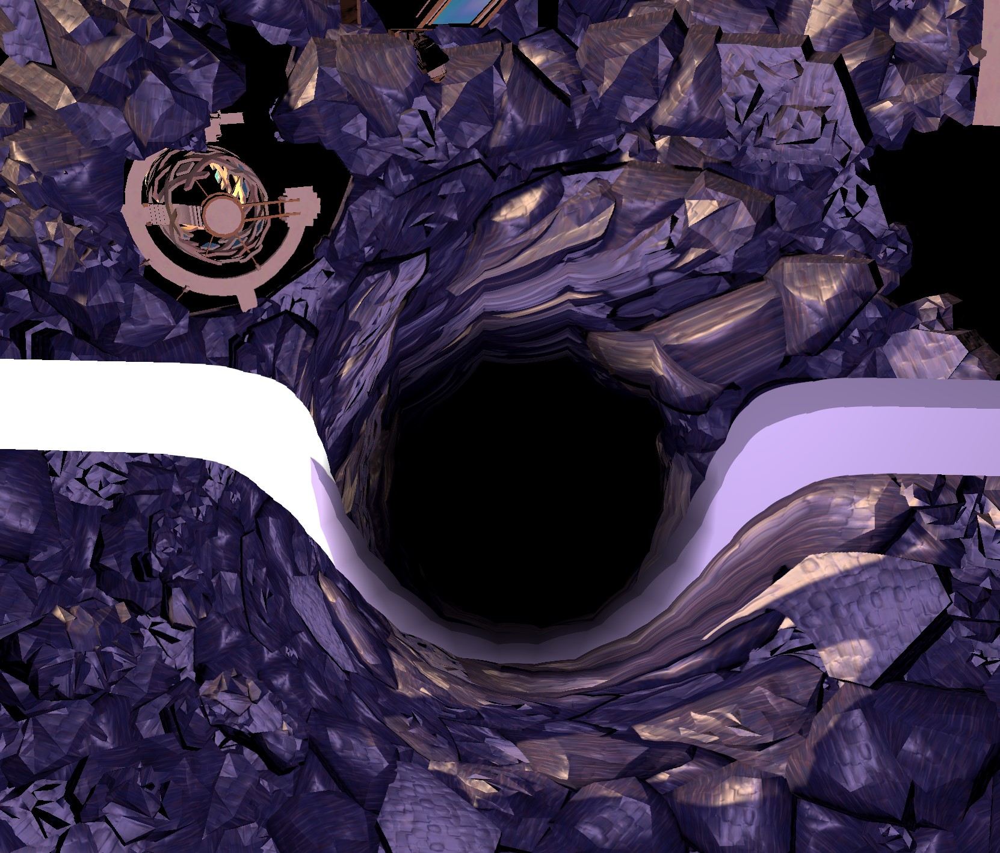
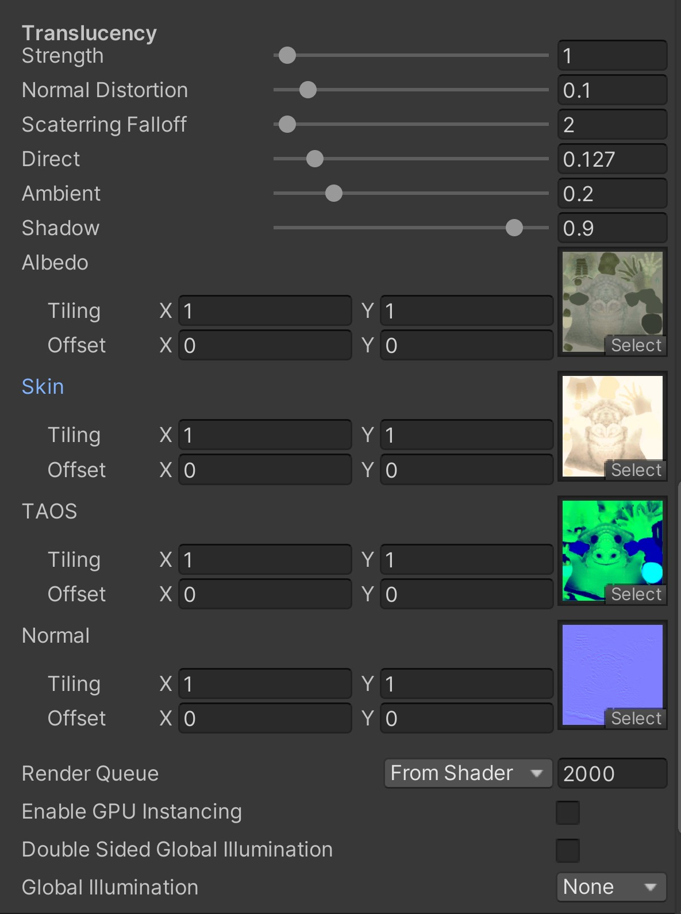
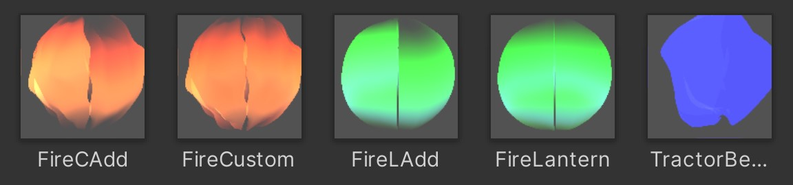

# Outer Wilds Shaders

This project is my attempt at recreating the (useful) Unity shaders from Outer Wilds

These were created using ASE in order to save my brain cells

The shaders are not exact, nor are they attempting to restore the originals with all of their values,
but they still attempt to recreate their visuals as best as possible, and along the way have helped me and hopefully others understand their structure

------------------------------------------

Here are some notable examples so far:

(Standard fire)

(Blackhole and its distortion)

(Ghostbird skin setup in inspector)

(The included premade materials, mostly just fire stuff)

------------------------------------------

Obviously there are more in there than what I showed, some foliage and other small, maybe useful, things.

Credits to Mobius Digital and Annapurna Interactive for making such an amazing game.
I take no credit for their work.
Note that some assets for the example materials are from Outer Wilds' data.

I would not recommend using these shaders for commercial purposes. 